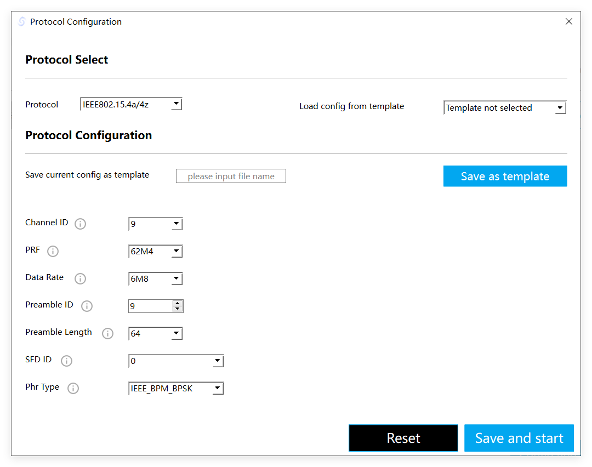

# python-sniffer

## 1. Introduction
A beginner-friendly python library for uwb dongle sniffer.

Supported Hardware: [Forthink UWB-Dongle-Sniffer](https://item.taobao.com/item.htm?id=846844890768)

### 1.1 Architecture

- Hardware: UWB Chips Support IEEE 802.15.4z, e.g. NCJ29D5, SR150, DW3000, etc. 

- Hardware Interface：NXP vendor specific UCI (UWB Command Interface)，communication interface, include in this library.

- Middleware：UCI interfaces, include in this library.

- Application：without UWB MAC，listener and transmitter for sniffer.

## 2. Example Apps

Example apps in the app floders.

### 2.1 sniffer_listener

The sniffer_listener example shows how to use the sniffer to listen the UWB frames.

 - `apps\sniffer\1_sniffer_listerner`, when the example is running, it continuously listens for the UWB signal in the air corresponding to the settings.
    **Sniffer Listener Paramters**  
    | Parameters | Available Value | Configurable default values |
    |  --- | ----------            | --- |
    | channel id | 5\6\8\9         | 9   |
    | sfd id     | 0\2             | 0   |
    | preamble id| 9~24            | 9   |

### 2.2 sniffer_transmitter

The sniffer_transmitter example shows how to use the `uwb dongle sniffer device` to transmit the UWB frames.

 - `apps\sniffer\2_sniffer_transmitter`, When the example runs, it sends the configured UWB signal.
    **Sniffer Transmitter Paramters**
    | Parameters | Available Value | Configurable default values |
    |  --- | ----------            | --- |
    | channel id | 5\6\8\9         | 9   |
    | sfd id     | 0\2             | 0   |
    | preamble id| 9~24            | 9   |
    | tx power   | -12~14 dBm      | 14 dBm|
    | tx num     | 0~0xFF, 0 means indefinitely | 100   |
    | tx interval| 0~0xFFFFFF us   | 50000 us ( 50ms ) |
    | tx payload | 2~127 bytes     | 0x11, 0x22, 0x33, 0x44 |

To watch the example running, you can run the `sniffer_v1.0.1.exe` with another `uwb dongle sniffer deivce` and config the Protocol `IEEE 802.15.4a/4z`, set the Channel ID 9, SFD ID 0, Preamble ID 9, like the picture shows:

Save and Start, then you will capture the examples sent UWB frames.

### 2.3 sniffer_listener_sequence
The sniffer_listener_sequence example shows how to use the sniffer to listen into a sequence of UWB frames.

 - `apps\sniffer\3_sniffer_listener_sequence`, When the example runs, it listens for a series of UWB frames based on pre-configured sequence information. You can control the interval between frames and the timeout time of each frame.

## 3. drivers

The hardware driver interface to operate the UWB hardware. The UWB Dongle use the FT4222h to support the 6-wire SPI FiRa-UCI.

## 4. middleware

### 4.1 UCI

The UCI Layer, to support FiRa-UCI Generic interface, support the FiRa-UCI Generic protocol.

### 4.2 Sniffer

- `SnifferDevice.py`, support the `SnifferDevice` and `SnifferParam` for the sniffer application.'
- `SnifferRegionParams.py`, the Sniffer params in Enum.

## 5. How to use the Library 

*Recommend using the Visual Studio Code for debugging and developing.*

### 5.1 Install the dependencies

Install the python libraries:

`python -m pip install -r requirements.txt`

if install slow, use the tsinghua source:

`pip install -r requirements.txt -i https://pypi.tuna.tsinghua.edu.cn/simple/`

The Python version : Python 3.11.3

### 5.2 set the PYTHONPATH in .env

In our application, the drivers and middleware libraries already added to the `.env` file, which can be well supported by the Visual Studio Code default configuration.

### 5.3 run the apps

Go to the `apps/`, run the application script. In the current application scripts, after you have script `1_sniffer_listener.py` or `3_sniffer_listener_sequence.py` running, run script `2_sniffer_transmitter.py` and you will see information about the sniffed UWB frames.

## 6. Known issues

If running the example scripts in the `apps/` folder, Trackback: `ModuleNotFoundError: No module named nxp_ft4222h`, you can create a virtual environment with the Visual Studio Code, and install the requirements.txt file. `Ctrl + Shift + P` and type `Python: Create Environment`.

## 7. Release log

### (2024.12.05-v0.1.2)
- **Features**:
  - First version of the `python-sniffer`, currently only support the Forthink UWB Dongle Sniffer Hardware.

## 8. Contact us

WebSite: https://www.forthink.com.cn
Email: dksupports@everhigh.com.cn
Shop:  [Forthink store](https://shop224007954.taobao.com/)
